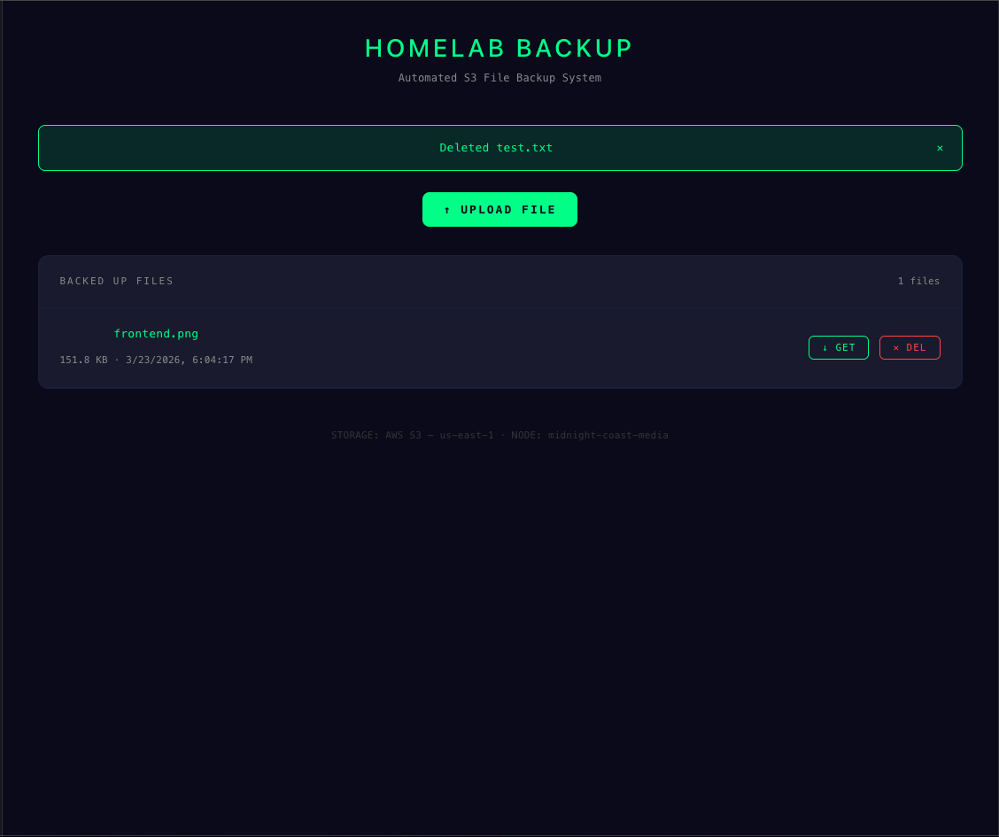

# Homelab Backup

An automated file backup system that watches a local folder on a self-hosted Ubuntu server and automatically syncs files to AWS S3. Includes a clean web dashboard to browse, upload, download, and delete backed up files.

> Built as a portfolio project while pursuing AWS Cloud Associate certification.

---

## Live Demo

🔗 [Coming soon — deploying to Vercel]



---

## Architecture
```
Local Folder (~/backups)
        |
        | watchdog detects new files
        v
File Watcher (watcher.py)
        |
        | boto3 upload
        v
    AWS S3 Bucket
    (us-east-1)
        |
        | FastAPI /files endpoint
        v
  React Dashboard
  (Vercel)
```

| Component | Technology | Role |
|-----------|-----------|------|
| Server | 2011 MBP — Ubuntu | Runs watcher + API |
| File Watcher | Python watchdog | Detects new files |
| Cloud Storage | AWS S3 | Stores backed up files |
| API | FastAPI (Python) | Serves file list, upload, delete, download |
| Frontend | React + Vite | Dashboard UI |
| Auth | AWS IAM | Least-privilege S3 access |
| Networking | Tailscale VPN | Secure remote access |

---

## Features

- Automatic file detection and upload via watchdog
- Manual file upload from the dashboard
- Browse all backed up files with size and timestamp
- One-click download via pre-signed S3 URLs
- Delete files directly from the dashboard
- Systemd service for automatic startup on boot
- IAM user with least-privilege S3-only access
- Environment variables for secure credential management

---

## Tech Stack

| Layer | Technology |
|-------|-----------|
| Backend | FastAPI (Python) |
| File Watching | watchdog |
| Cloud Storage | AWS S3 |
| AWS SDK | boto3 |
| Frontend | React + Vite |
| Deployment | Vercel |
| Process Manager | systemd |
| Networking | Tailscale VPN |

---

## API Endpoints

| Endpoint | Method | Description |
|----------|--------|-------------|
| `/` | GET | Health check |
| `/files` | GET | List all backed up files |
| `/upload` | POST | Upload a file to S3 |
| `/files/{key}` | DELETE | Delete a file from S3 |
| `/download/{key}` | GET | Get pre-signed download URL |

---

## Security

- IAM user has **AmazonS3FullAccess** scoped to backup bucket only
- AWS credentials stored as environment variables, never in code
- `.env` file excluded from version control via `.gitignore`
- All remote access via Tailscale VPN mesh
- S3 bucket has public access blocked

---

## Deployment

Backend runs as a systemd service on Ubuntu Server:
```bash
sudo systemctl enable homelab-backup
sudo systemctl start homelab-backup
```

Watcher automatically monitors `~/backups` and uploads any new or modified files to S3.

---

## Author

**Chaz Goodwin**
Homelab enthusiast | AWS Cloud Associate candidate
[GitHub](https://github.com/cgoodwin469)